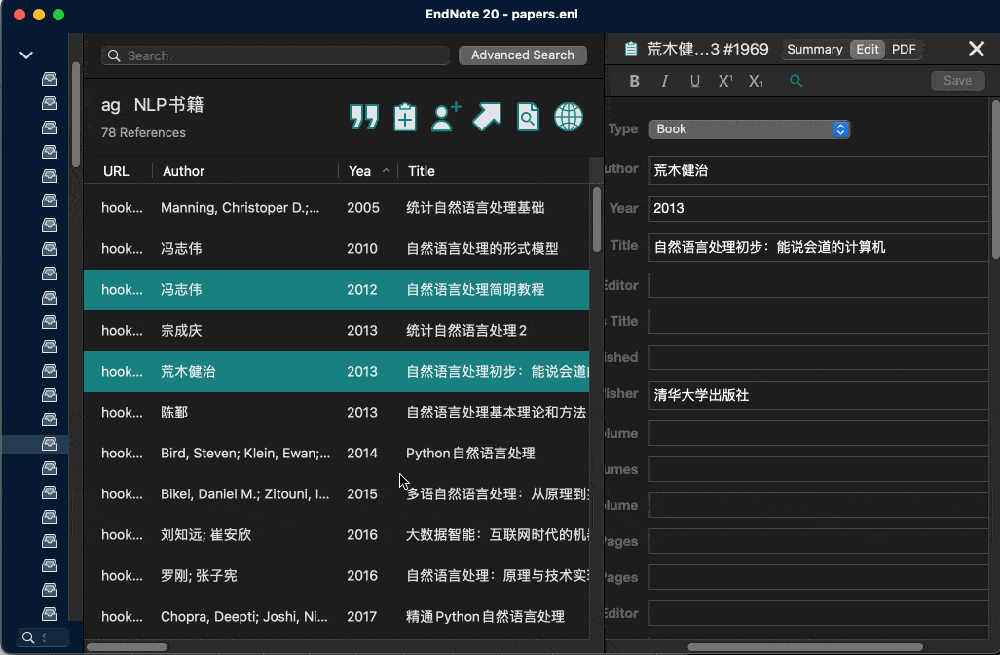
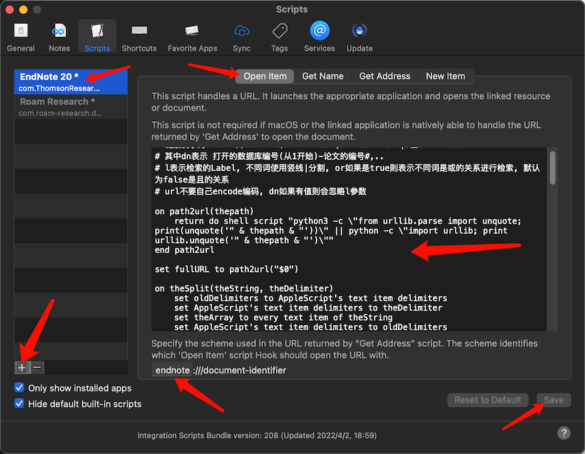
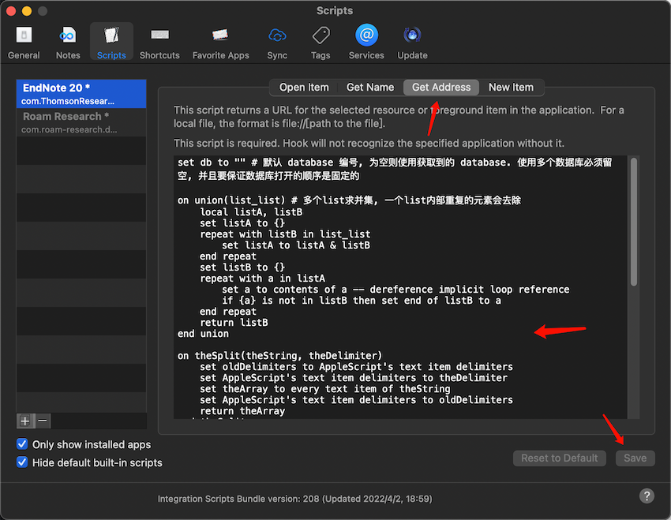

# endnote-hook

给endnote的mac用户写了一个便捷使用的脚本, 可以直接为endnote中的文献生成一个链接, 任意地方打开链接可以自动跳转到endnote中对应的文献

用 [hook](https://hookproductivity.com) 实现点击网址直接在endnote中打开对应的参考文献, 或者打开相应标签的文献.

example: 

# method

step 1: 将 [open.scpt](open.scpt) 中的内容拷贝到脚本, 如下图:

step 2: 将 [address.scpt](address.scpt) 中的内容拷贝到脚本, 如下图:

reference: [document](https://researchsoftware.com/sites/researchsoftware.com/files/files/product_attachments/EndNote%20X9%20Mac%20Documentation.pdf)
