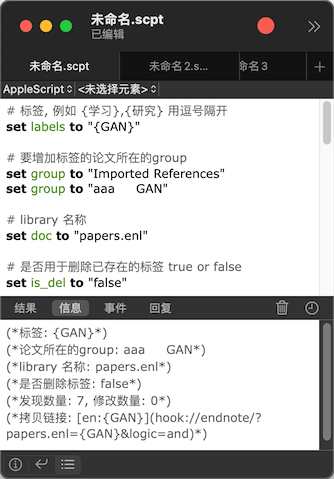
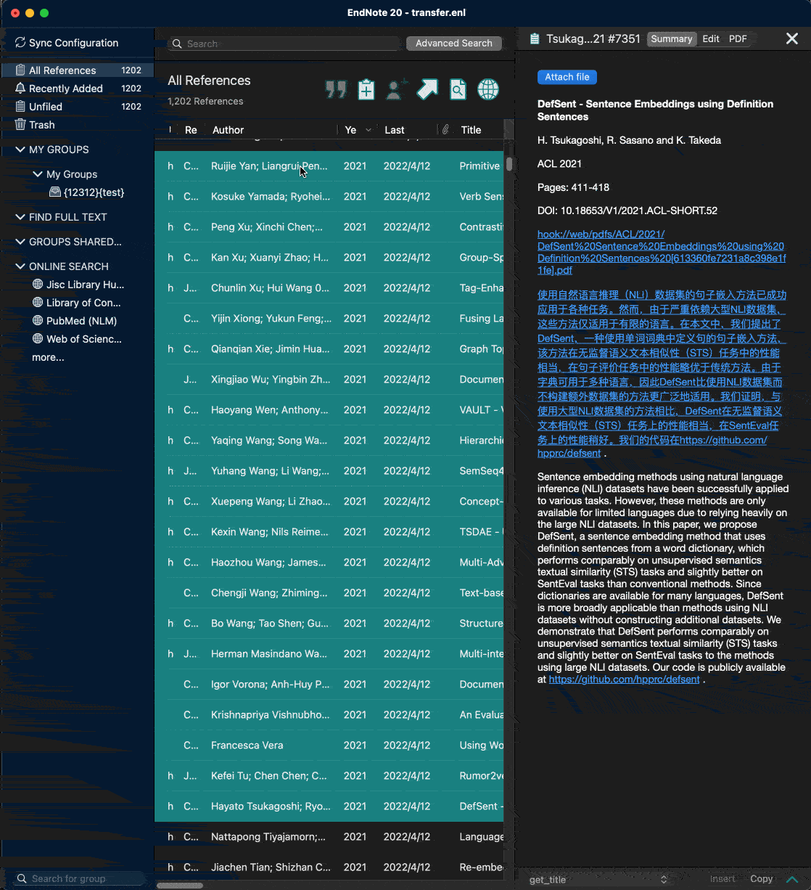

## 1. 自动为endnote中多个group的所有记录增加或删除label, 并生成跳转的链接
方法: 将 [1.applescript](1.applescript) 中的内容拷贝到系统自带的脚本编辑器app, 然后修改4个参数, 如下图:

点击右上角▶️运行, 点击左下角清单符号查看信息

## 2. 统计筛选的group中每个标签的数量

## 3. 统计出现在标题中某些词的排列组合的论文数量 (windows/mac)
1. 安装 python3 和 pip
2. 运行 pip install tqdm pyperclip tsc_base jieba stanza
3. 将 [get_title](get_title.ens) 文件用 endnote 打开并保存
4. 在 endnote 中选择导出的参考文献格式为 get_title
5. 选中要统计的参考文献, 右键点击 Copy Formatted references (借助剪切板)
6. 进入当前目录运行程序 python3 3.stat_word_frequency.py
7. 还可以进入 [3.stat_word_frequency.py](3.stat_word_frequency.py) 修改前面3个参数来控制输出内容

